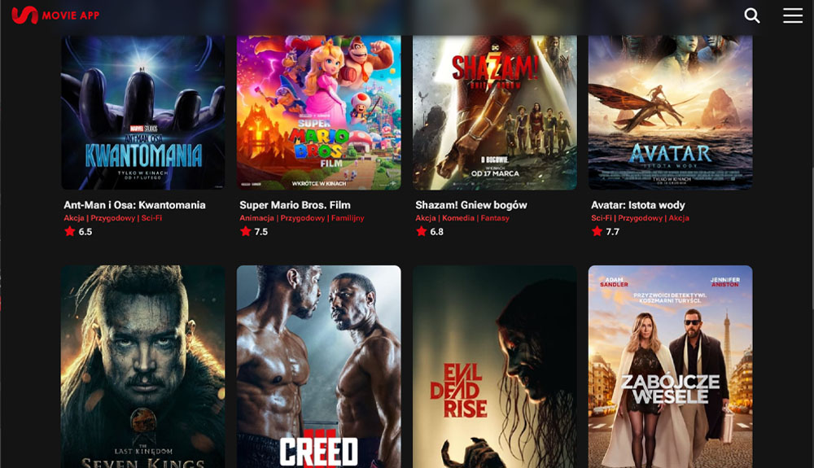
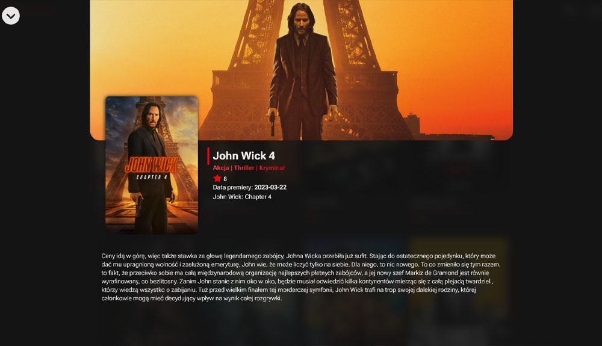
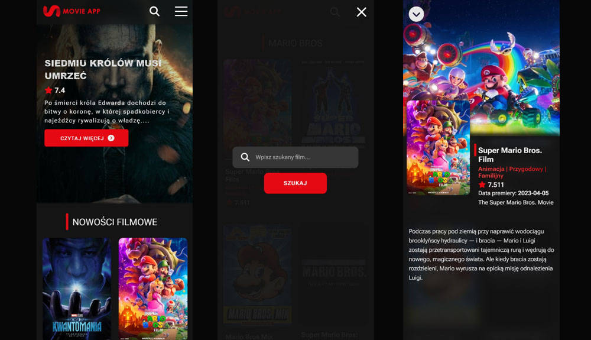

<a id="readme-top"></a>

<br />
<div align="center">
    

<h2 align="center">Movie Library App</h2>
<p>The project presents a movie library. After opening the application in the header section you can see the random movie from twenty new movies.</p><p>Under the header section there is a list of new films. The list contains the title, category and rating for each movie. After clicking on the movie  you can notice a section which contains more information. In the upper right corner there is a movie search engine and a menu.</p>
<p>The application is not finish yet. The project was created for educational purposes. The main idea of my project is to learn TypeScript.</p>
<p>Enjoy</p>

  <p align="center">
    <a href="https://movielibrary-application.netlify.app/">View Demo</a> · <a href="https://github.com/AndrzejPuczko/movie-library-app/issues">Report Bug</a>
  </p>
</div>







<p align="right">(<a href="#readme-top">back to top</a>)</p>

### Installation
If you want to use this app just:

1. Clone the repo
   ```sh
   git clone https://github.com/AndrzejPuczko/movie-library-app
   ```
2. Install NPM packages
   ```sh
   npm install
   ```
3. Run the development server
   ```sh
   npm run dev
   ```

<p align="right">(<a href="#readme-top">back to top</a>)</p>

## Contact

Andrzej Puczko - [puczko.andrzej@gmail.com](mailto:puczko.andrzej@gmail.com)

Project Link: [https://movielibrary-application.netlify.app](https://movielibrary-application.netlify.app)

<p align="right">(<a href="#readme-top">back to top</a>)</p>